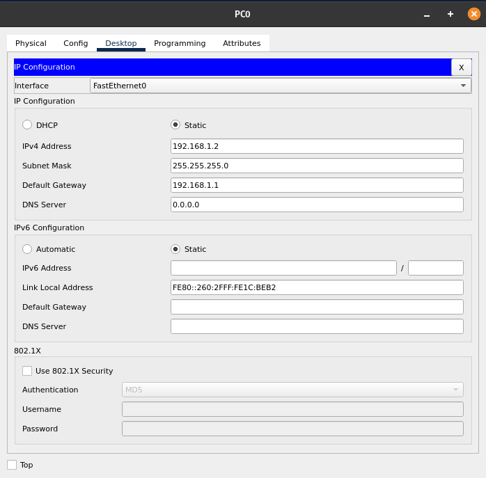
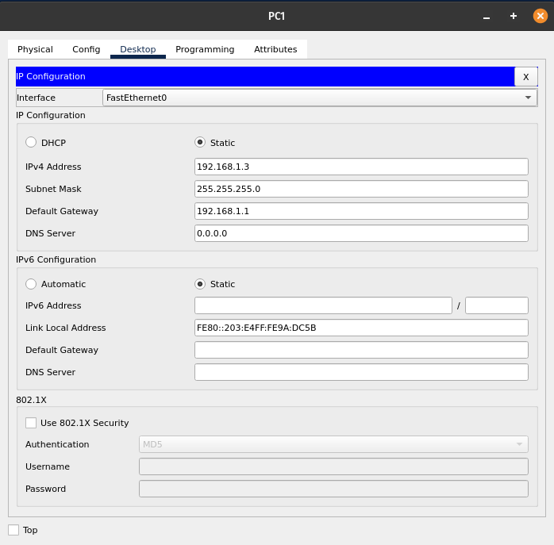

# LAB 01 - Interligando Redes

## Topologia

<div style='display: inline-block'>
   
</div>

## Configuração manual

- Router

```
Router > ena
Router > configute terminal
Router(config) > interface GigabitEthernet0/1
Router(config-if) > ip address 192.168.0.1 255.255.255.0
Router(config-if) > no shutdown
Router(config-if) > exit
Router(config) > interface GigabitEthernet0/2
Router(config-if) > ip address 192.168.1.1 255.255.255.0
Router(config-if) > no shutdown
Router(config-if) > exit
Router(config) > end
Router > wr
```

- Sh int Router show:
```
GigabitEthernet0/1 is up, line protocol is up (connected)
  Hardware is CN Gigabit Ethernet, address is 0001.43ae.0d02 (bia 0001.43ae.0d02)
  Internet address is 192.168.0.1/24
  MTU 1500 bytes, BW 1000000 Kbit, DLY 100 usec,
     reliability 255/255, txload 1/255, rxload 1/255
  Encapsulation ARPA, loopback not set
  Keepalive set (10 sec)
  Full-duplex, 100Mb/s, media type is RJ45
  output flow-control is unsupported, input flow-control is unsupported
  ARP type: ARPA, ARP Timeout 04:00:00, 
  Last input 00:00:08, output 00:00:05, output hang never
  Last clearing of "show interface" counters never
  Input queue: 0/75/0 (size/max/drops); Total output drops: 0
  Queueing strategy: fifo
  Output queue :0/40 (size/max)
  5 minute input rate 0 bits/sec, 0 packets/sec
  5 minute output rate 0 bits/sec, 0 packets/sec
     0 packets input, 0 bytes, 0 no buffer
     Received 0 broadcasts, 0 runts, 0 giants, 0 throttles
     0 input errors, 0 CRC, 0 frame, 0 overrun, 0 ignored, 0 abort
     0 watchdog, 1017 multicast, 0 pause input
     0 input packets with dribble condition detected
     0 packets output, 0 bytes, 0 underruns
     0 output errors, 0 collisions, 1 interface resets
     0 unknown protocol drops
     0 babbles, 0 late collision, 0 deferred
     0 lost carrier, 0 no carrier
     0 output buffer failures, 0 output buffers swapped out
```

```
GigabitEthernet0/2 is up, line protocol is up (connected)
  Hardware is CN Gigabit Ethernet, address is 0001.43ae.0d03 (bia 0001.43ae.0d03)
  Internet address is 192.168.1.1/24
  MTU 1500 bytes, BW 1000000 Kbit, DLY 100 usec,
     reliability 255/255, txload 1/255, rxload 1/255
  Encapsulation ARPA, loopback not set
  Keepalive set (10 sec)
  Full-duplex, 100Mb/s, media type is RJ45
  output flow-control is unsupported, input flow-control is unsupported
  ARP type: ARPA, ARP Timeout 04:00:00, 
  Last input 00:00:08, output 00:00:05, output hang never
  Last clearing of "show interface" counters never
  Input queue: 0/75/0 (size/max/drops); Total output drops: 0
  Queueing strategy: fifo
  Output queue :0/40 (size/max)
  5 minute input rate 0 bits/sec, 0 packets/sec
  5 minute output rate 0 bits/sec, 0 packets/sec
     0 packets input, 0 bytes, 0 no buffer
     Received 0 broadcasts, 0 runts, 0 giants, 0 throttles
     0 input errors, 0 CRC, 0 frame, 0 overrun, 0 ignored, 0 abort
     0 watchdog, 1017 multicast, 0 pause input
     0 input packets with dribble condition detected
     0 packets output, 0 bytes, 0 underruns
     0 output errors, 0 collisions, 1 interface resets
     0 unknown protocol drops
     0 babbles, 0 late collision, 0 deferred
     0 lost carrier, 0 no carrier
     0 output buffer failures, 0 output buffers swapped out
```

### Configuration PC network

<div style='display: inline-block'>
   
</div>

</br>
<div style='display: inline-block'>
   
</div>

</br>
<div style='display: inline-block'>
   
</div>

</br>
<div style='display: inline-block'>
   
</div>