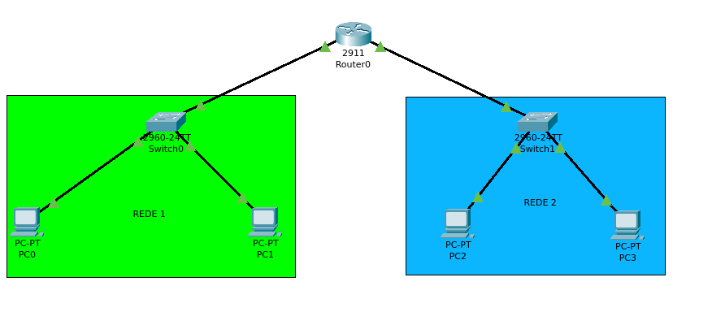

# LAB 01 - Interligando Redes

## Topologia

<div style='display: inline-block'>
   
</div>

## Configuração manual

- Router

```
Router > ena
Router > configute terminal
Router(config) > interface GigabitEthernet0/1
Router(config-if) > ip address 192.168.0.1 255.255.255.0
Router(config-if) > no shutdown
Router(config-if) > exit
Router(config) > interface GigabitEthernet0/2
Router(config-if) > ip address 192.168.1.1 255.255.255.0
Router(config-if) > no shutdown
Router(config-if) > exit
Router(config) > end
Router > wr
```

- Sh int Router show:

