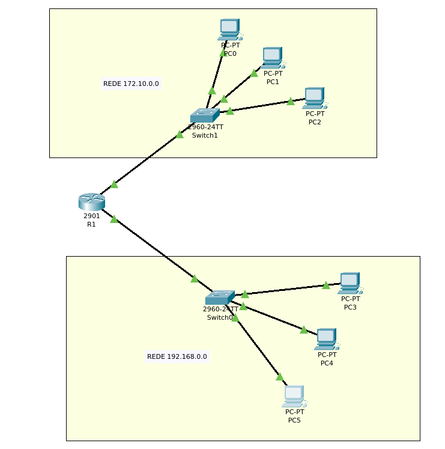
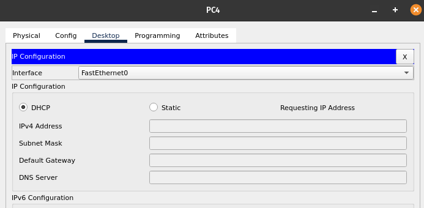
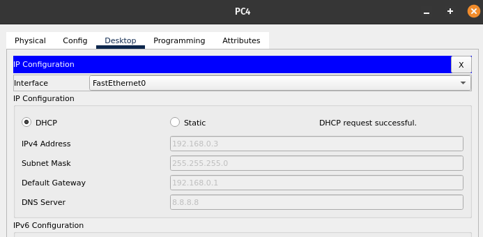

# LAB 02 - Configurando DHCP

## Topologia

<div style='display: inline-block'>
   
</div>

</br>

## Configuração manual

- Router

```
Router>
Router>ena
Router#configure terminal
Enter configuration commands, one per line.  End with CNTL/Z.
Router(config)#interface giga0/0
Router(config-if)#no shutdown 

Router(config-if)#
%LINK-5-CHANGED: Interface GigabitEthernet0/0, changed state to up

%LINEPROTO-5-UPDOWN: Line protocol on Interface GigabitEthernet0/0, changed state to up

Router(config-if)#exit
Router(config)#interface giga0/1
Router(config-if)#ip address 192.168.0.1 255.255.255.0
Router(config-if)#no shutdown 

Router(config-if)#
%LINK-5-CHANGED: Interface GigabitEthernet0/1, changed state to up

%LINEPROTO-5-UPDOWN: Line protocol on Interface GigabitEthernet0/1, changed state to up

Router(config-if)#exit


```

- Server DHCP 1
```
Router(config)#ip dhcp pool dhcp-server 
Router(dhcp-config)#network 172.10.0.0 255.255.255.0
Router(dhcp-config)#domain-name dhcp-server
Router(dhcp-config)#default-router 172.10.0.1 
Router(dhcp-config)#dns-server 172.10.0.1
Router(dhcp-config)#dns-server 8.8.8.8
Router(dhcp-config)#exit
Router(config)#do wr
Building configuration...
[OK]
```

- Server DHCP 2

```
Router#configure terminal
Enter configuration commands, one per line.  End with CNTL/Z.
Router(config)#ip d
Router(config)#ip dhc
Router(config)#ip dhcp pool dhcp-server-2
Router(dhcp-config)#network 192.168.0.0 255.255.255.0
Router(dhcp-config)#dom
Router(dhcp-config)#domain-name dhcp-server-2
Router(dhcp-config)#def
Router(dhcp-config)#default-router 192.168.0.1
Router(dhcp-config)#dn
Router(dhcp-config)#dns-server 192.168.0.1
Router(dhcp-config)#dn
Router(dhcp-config)#dns-server 8.8.8.8
Router(dhcp-config)#exit
Router(config)#%DHCPD-4-PING_CONFLICT: DHCP address conflict:  server pinged 192.168.0.1.

Router(config)#do wr
Building configuration...
[OK]
```
- Configuração dos computadores

  - Rede 172.10.0.0 

<div style='display: inline-block'>
   
</div>

</br>

<div style='display: inline-block'>
   
</div>

</br>


   - Rede 192.168.0.0
   
<div style='display: inline-block'>
   
</div>

</br>

<div style='display: inline-block'>
   
</div>


</br>

- Pings
```
Router#ping 172.10.0.4

Type escape sequence to abort.
Sending 5, 100-byte ICMP Echos to 172.10.0.4, timeout is 2 seconds:
.!!!!
Success rate is 80 percent (4/5), round-trip min/avg/max = 0/0/0 ms

```


```
Router#ping 192.168.0.2

Type escape sequence to abort.
Sending 5, 100-byte ICMP Echos to 192.168.0.2, timeout is 2 seconds:
.!!!!
Success rate is 80 percent (4/5), round-trip min/avg/max = 0/0/1 ms

Router#
```

